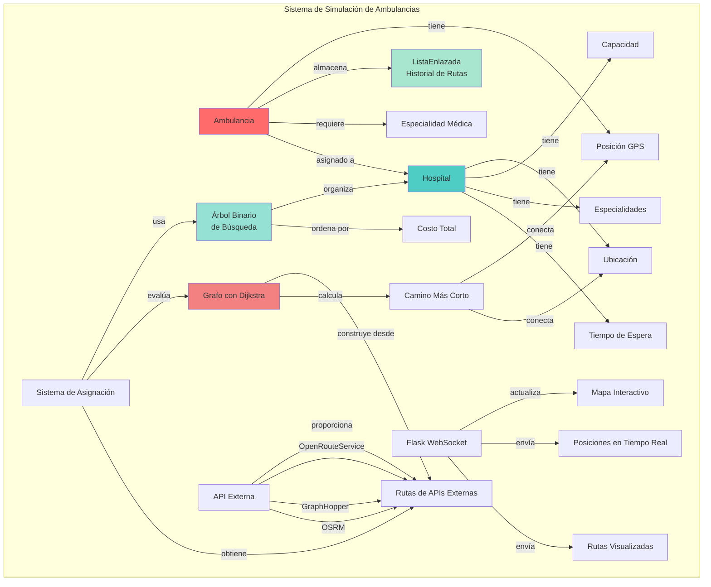
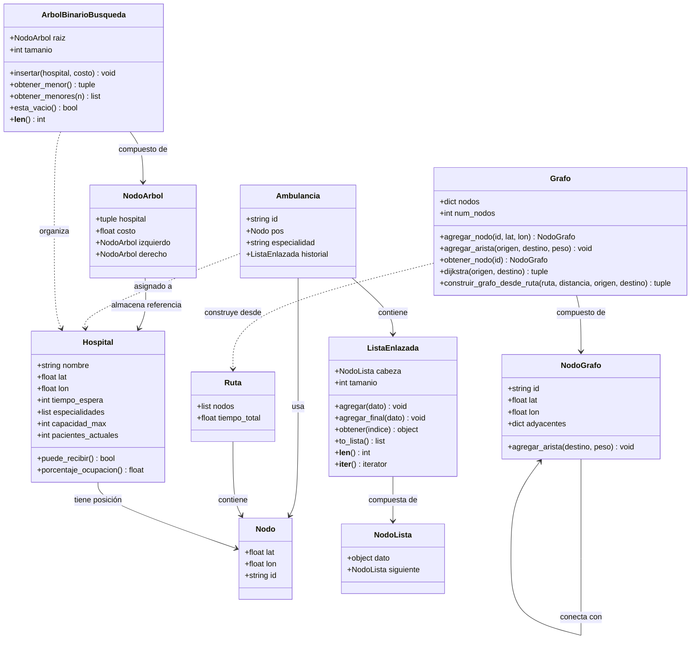
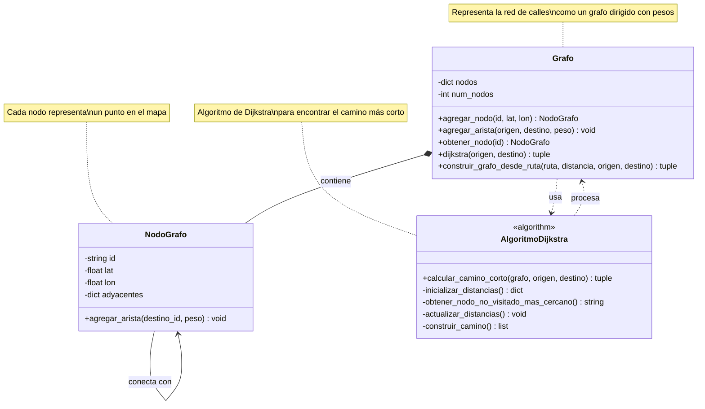
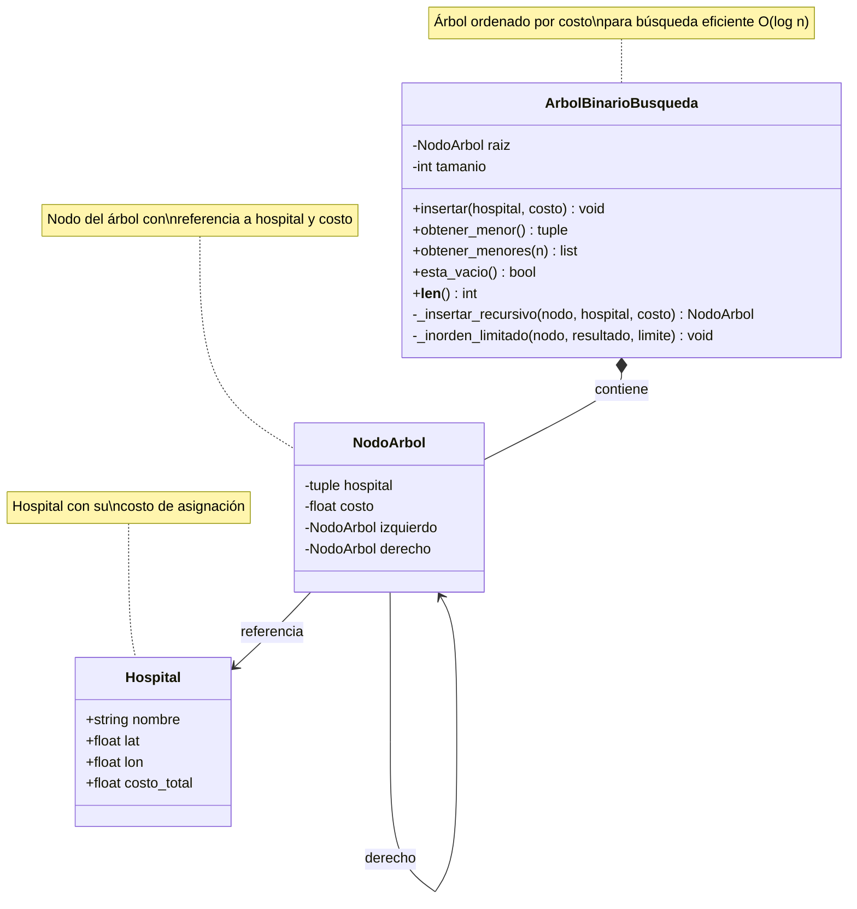
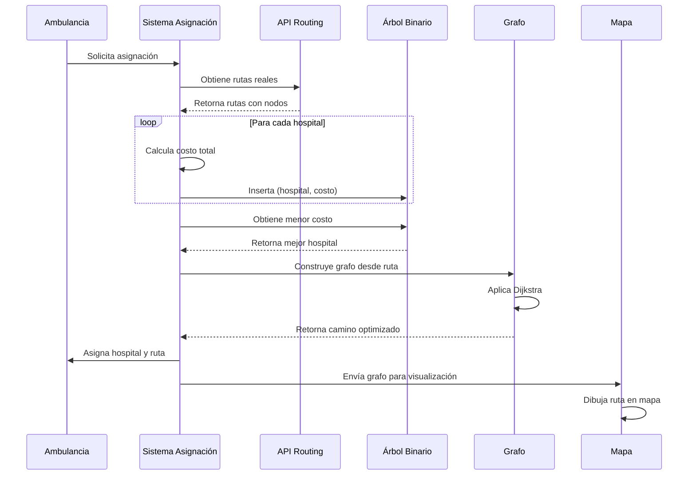

# 🚑 Simulador Profesional de Ambulancias - Popayán

Se crea un sistema web en tiempo real para simular la asignación y movimiento de ambulancias hacia hospitales en la ciudad de Popayán. Se implementan estructuras de datos avanzadas (Listas Enlazadas, Árboles Binarios de Búsqueda y Grafos) con algoritmos de optimización para encontrar las rutas más eficientes siguiendo las carreteras reales de la ciudad.

## 📋 Descripción

Este simulador permite visualizar en tiempo real cómo las ambulancias se asignan a hospitales basándose en múltiples criterios de optimización:

- **Rutas reales**: Utiliza APIs de routing (OpenRouteService, GraphHopper, OSRM) para obtener rutas que siguen las carreteras reales
- **Algoritmo de Dijkstra**: Aplica el algoritmo de Dijkstra sobre grafos para encontrar el camino más corto
- **Optimización multi-criterio**: Considera tiempo de viaje, especialidad médica, capacidad del hospital y tiempo de espera
- **Visualización en tiempo real**: Mapa interactivo con actualizaciones mediante WebSockets

## 🏗️ Estructuras de Datos Implementadas

### 1. Lista Enlazada (`ListaEnlazada`)
Almacena el historial de rutas de cada ambulancia de forma eficiente.

**Características:**
- Implementación de lista enlazada simple
- Operaciones: `agregar()`, `agregar_final()`, `obtener()`, `to_lista()`
- Complejidad: O(1) para inserción, O(n) para búsqueda

**Uso:**
```python
ambulancia.historial.agregar_final({
    "hospital": "Hospital X",
    "tiempo": 15.5,
    "timestamp": time.time(),
    "ruta": [...]
})
```

### 2. Árbol Binario de Búsqueda (`ArbolBinarioBusqueda`)
Organiza hospitales por costo/prioridad para optimizar la búsqueda del mejor hospital.

**Características:**
- Árbol binario de búsqueda ordenado por costo
- Operaciones: `insertar()`, `obtener_menor()`, `obtener_menores()`, `inorden()`
- Complejidad: O(log n) para inserción y búsqueda en promedio

**Uso:**
```python
arbol = ArbolBinarioBusqueda()
arbol.insertar((hospital, ruta), costo)
mejor_hospital, mejor_costo = arbol.obtener_menor()
```

### 3. Grafo (`Grafo`)
Representa la red de calles de la ciudad y calcula rutas óptimas usando el algoritmo de Dijkstra.

**Características:**
- Grafo dirigido con pesos (distancias)
- Implementación completa del algoritmo de Dijkstra
- Construcción dinámica desde rutas de APIs externas
- Operaciones: `agregar_nodo()`, `agregar_arista()`, `dijkstra()`, `construir_grafo_desde_ruta()`

**Uso:**
```python
grafo = Grafo()
grafo.agregar_nodo("origen", lat, lon)
grafo.agregar_nodo("destino", lat, lon)
grafo.agregar_arista("origen", "destino", distancia)
distancia, camino, tiempo = grafo.dijkstra("origen", "destino")
```

## 📊 Diagramas

### Diagrama Conceptual del Sistema



### Diagrama de Clases



### Diagrama UML: Grafo y Dijkstra



### Diagrama UML: Árbol Binario de Búsqueda



### Flujo de Funcionamiento



## 🚀 Instalación y Uso

### Requisitos

```bash
pip install flask flask-socketio requests
```

### Ejecución

```bash
python app.py
```

Luego abre tu navegador en `http://127.0.0.1:5000`


## 📝 Autores

Johan Stiven Rengifo
Tatiana Muñoz Daza 

## 📄 Licencia

Este proyecto es de uso educativo y académico.

